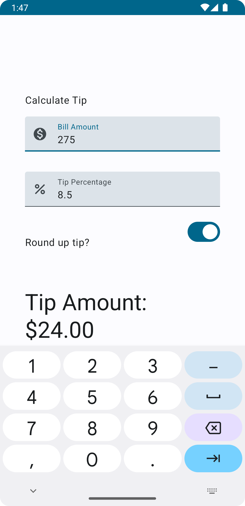

## Tip Time App

This is a simple app that allows users to create and view tips. The app is built using the Django framework and uses a SQLite database to store the tips. The app has a simple user interface that allows users to add new tips, view existing tips, and delete tips. The app also has a search feature that allows users to search for tips based on keywords.

 
 

## With Round Tip

 
 

## Without Round Tip
